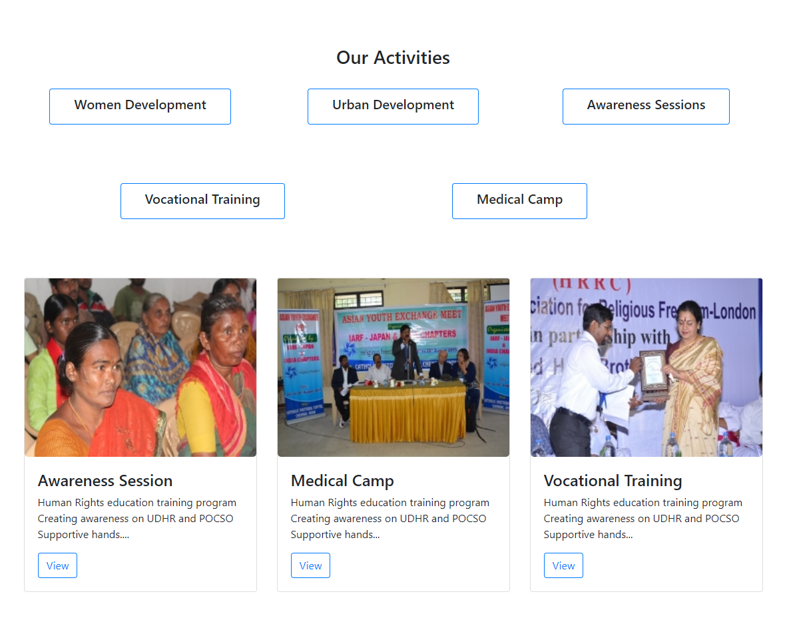
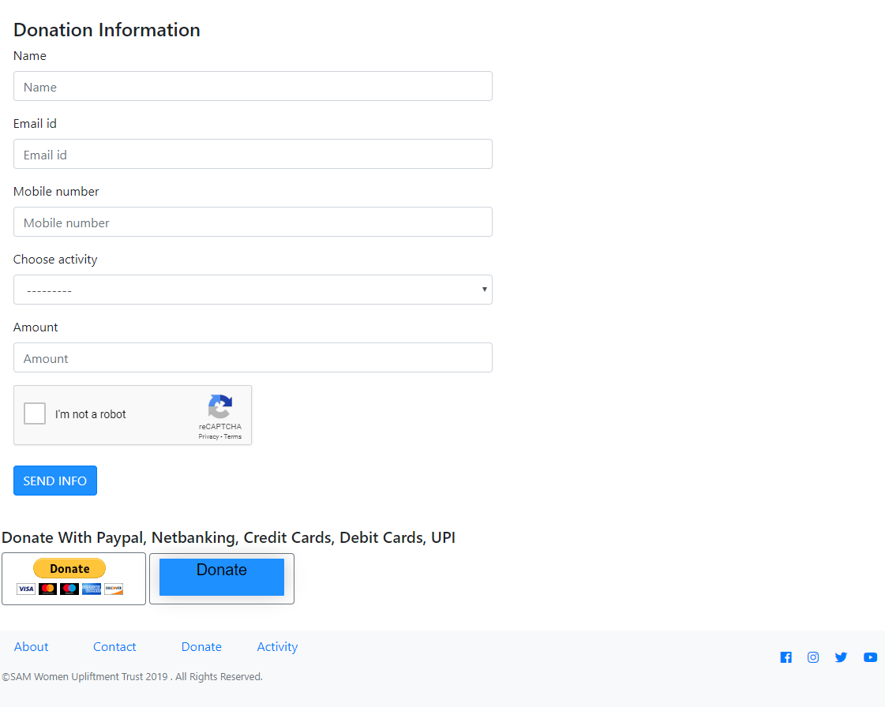

# Django_donation_app
 This project is powered by Django and I use PayPal API for collect donation.

### Install and active virtual-environment by command
* pip install virtualenv
* virtualenv your_environment_name
* activate
### Install all the requirements by command
* pip install -r requirements.txt
### Run the project by command
* python manage.py runserver

## Database:
* Local: PostgreSQL

### Screen shots

## Home Page

## Donation Page

